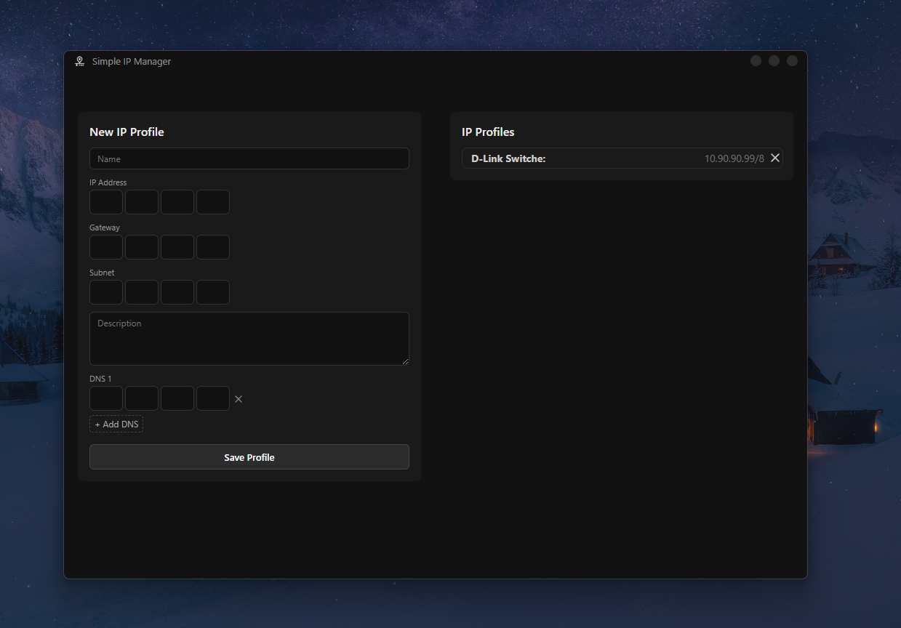
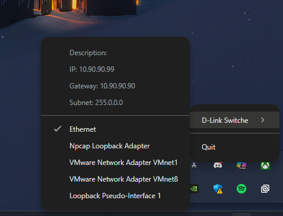

# ⚠️ Requires Administrator Privileges

> **Important:** This application uses Windows `netsh` commands to change network configurations, which **requires administrator privileges** to function correctly. Make sure to run the app as an administrator.

---

# 🖧 Simple IP Manager


> A blazing-fast IP profile switcher for sysadmins and network engineers — built with Electron, React, and TypeScript.

---

## 📦 Download v1.0 [here](https://github.com/maxi-schaefer/simple-ip-manager/releases/download/1.0/Setup.exe)

## 🚀 Overview

**Simple IP Manager** is a lightweight desktop tool that helps system administrators and network engineers manage and switch between multiple static IP configurations right from the system tray.

Whether you're managing multiple VLANs, test networks, or client configurations, this app saves time and reduces manual errors. Just click and switch!

---

## 🔧 Features

- ⚡ **Quick Tray Access** – Instantly switch between IP profiles via the system tray.
- 📁 **Profile Management** – Add, edit, or remove IP configuration profiles.
- 🔐 **Electron-based** – Secure, lightweight, and fast.
- 🌐 **Designed for Network Pros** – Tailored for sysadmins and IT support engineers.

---

## 📸 Screenshots

| Dashboard | Tray Menu |
|----------|-----------|
|  |  |

---

## 📦 Installation

### Download

Go to the [Releases](https://github.com/maxi-schaefer/simple-ip-manager/releases) section and download the appropriate installer for your operating system.

### Build from Source

Clone the repository and install dependencies:

```bash
git clone https://github.com/maxi-schaefer/simple-ip-manager.git
cd simple-ip-manager
npm install
npm run package
```

## 👨‍💻 For Contributors

We ❤️ contributions! Follow the steps below to get started:

### 1. Clone & Setup
```bash
git clone https://github.com/maxi-schaefer/simple-ip-manager.git
cd simple-ip-manager
npm install
```

### 2. Run the App in Development
```bash
npm start
```
This launches the app with hot-reloading for both the main and renderer processes.

### 3. Scripts You Should Know
- `npm start` - Start the development version
- `npm run package` - Package the app (no auto-publish)
- `npm test` - Run Jest test suite
- `npm run lint` – Lint the codebase

## 📁 Project Structure
- `/src` - Main app source code
- `/release` - Output folder for build packages
- `/.sim` - Custom scripts, configs and Webpack settings
- `/assets` - Icons, images, and macOS entitlements (coming soon)

## 📊 Tech Stack
| Tech | Usage |
|----------|-----------|
| Electron | Desktop runtime |
| React + TS | UI and state management |
| Webpack | Bundling |
| Jest | Testing |

## 📝 License
Licensed under the [MIT License](./LICENSE)

## 🙌 Support
If you found this project useful, consider giving it a ⭐ on [Github](https://github.com/maxi-schaefer/simple-ip-manager)

## 🌍 Author
[Max Schäfer](https://github.com/maxi-schaefer)
